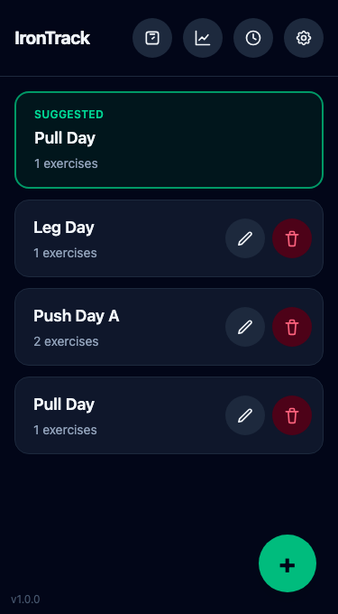

# IronTrack

**[Open the app →](https://hk0i.github.io/irontrack/)**

A minimal, offline-first workout tracker. Build routines, log sets as you train, and track your progress over time. Installable as a PWA and works fully offline once loaded.

## Using the app

1. **Build a routine** — tap **+** on the Dashboard, give it a name, and add exercises. Tap the link icon next to two exercises to pair them as a superset.
2. **Start a workout** — tap a routine card, or the green **Suggested** card (which automatically rotates through your routines each time you finish one), to open the tracking screen.
3. **Log sets** — enter weight and reps, then check the box to save the set. Weight is optional, for bodyweight or banded exercises. Invalid fields are outlined in red.
4. **Track progress** — the chart icon in the header shows a trend line per exercise; the clock icon shows your full workout history, where past entries can be edited or deleted.
5. **Track body metrics** — the scale icon lets you log body weight and measurements like waist, arm, and thigh size, including your own custom trackers.
6. **Settings** — switch your preferred unit (lbs/kg), and export or import a full backup of your data as a JSON file.

Everything is stored locally in your browser (IndexedDB) — nothing is sent to a server.
