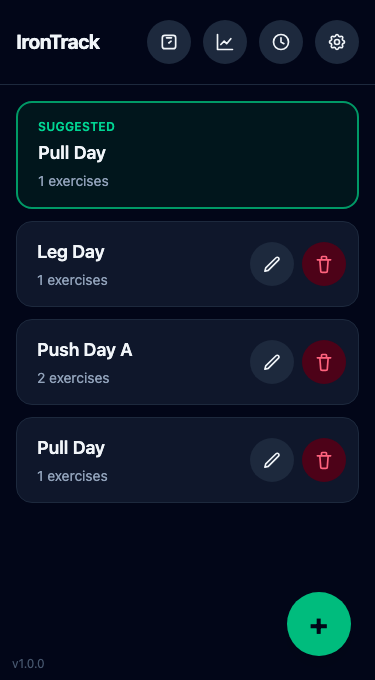

# IronTrack

**[Open the app →](https://hk0i.github.io/irontrack/)**

A minimal, offline-first workout tracker. Build routines, log sets as you train, and track your progress over time. Installable as a PWA and works fully offline once loaded.



## Using the app

1. **Build a routine** — tap **+** on the Dashboard, give it a name, and add exercises. Tap the link icon next to two exercises to pair them as a superset.
2. **Start a workout** — tap a routine card, or the green **Suggested** card (which automatically rotates through your routines each time you finish one), to open the tracking screen.
3. **Log sets** — enter weight and reps, then check the box to save the set. Weight is optional, for bodyweight or banded exercises. Invalid fields are outlined in red.
4. **Track progress** — the chart icon in the header shows a trend line per exercise; the clock icon shows your full workout history, where past entries can be edited or deleted.
5. **Track body metrics** — the scale icon lets you log body weight and measurements like waist, arm, and thigh size, including your own custom trackers.
6. **Settings** — switch your preferred unit (lbs/kg), and export or import a full backup of your data as a JSON file.

Everything is stored locally in your browser (IndexedDB) — nothing is sent to a server.

## Local development

Day-to-day dev/build/preview commands are plain npm scripts. A small Python-based task runner ([pyinvoke](https://www.pyinvoke.org/)) wraps them and adds a `release` task for tagging versions — installing Python is only needed if you want that wrapper.

**1. Install Python 3** (skip if you already have it — `python3 --version`):

- **macOS**: `brew install python3` ([Homebrew](https://brew.sh/)), or the installer from [python.org](https://www.python.org/downloads/).
- **Windows**: the installer from [python.org](https://www.python.org/downloads/) (check "Add python.exe to PATH"), or `winget install Python.Python.3.13`.
- **Linux**: use your distro's package manager, e.g. `sudo apt install python3 python3-venv` (Debian/Ubuntu) or `sudo dnf install python3` (Fedora).

**2. Create and activate a virtual environment**, then install the task runner:

```sh
python3 -m venv .venv
source .venv/bin/activate      # Windows: .venv\Scripts\activate
pip install -r requirements.txt
```

**3. Run tasks** with `invoke`:

```sh
invoke --list    # show all tasks
invoke run       # npm run dev
invoke build     # npm run build
invoke preview   # npm run preview
invoke release   # tag the current package.json version and push it
```

### Optional: auto-activate the venv on `cd`

This repo ships a `.envrc` for [direnv](https://direnv.net/), so the `.venv` activates automatically whenever you `cd` into the project (and deactivates when you leave).

1. Install direnv, e.g. `brew install direnv` (macOS) or see the [install docs](https://direnv.net/docs/installation.html) for other platforms.
2. Hook it into your shell (one-time setup — see direnv's [shell hook docs](https://direnv.net/docs/hook.html), e.g. `eval "$(direnv hook zsh)"` in `~/.zshrc`).
3. From the repo root, run `direnv allow` once — direnv never runs an `.envrc` without this explicit opt-in.

After that, `cd`-ing into the project activates `.venv` automatically.
