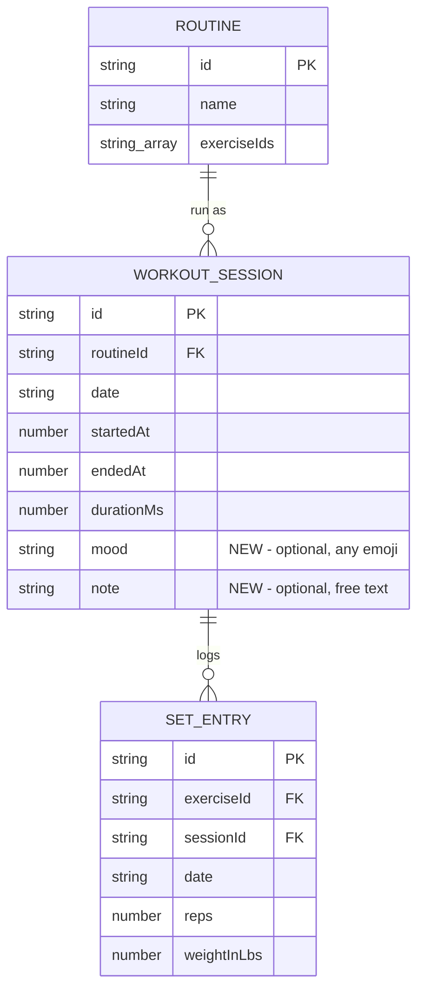

# EDD: Mood + Notes on Finish Workout

> **Date:** 2026-08-10
> **Author:** Gregory McQuillan

## Goal

Capture how a workout felt — a quick emoji rating plus an optional free-text note — at the moment the user taps **Finish Workout**. Lift numbers alone don't explain why a session was weaker or stronger than usual (fatigue, injury, illness, better mind-muscle connection that day, etc.); this gives the user a lightweight way to leave themselves that context for later, without requiring it.

## ERD



No new tables, no new relationships — `mood`/`note` are additive columns on the existing `WORKOUT_SESSION` row, same shape as the `durationMs` addition in [2026-07-15-Workout-Duration.edd.md](2026-07-15-Workout-Duration.edd.md).

## Data model

`WorkoutSession` (`src/shared/db.ts:67-74`) gains two optional plain fields — no Dexie `.version()` bump needed. Same reasoning as every other optional field added to this codebase since v1 (`Exercise.resistanceType`, `SetEntry.bandColors`, `SetEntry.routineId`/`sessionId`): unindexed, backward-compatible, old rows simply lack the key.

```ts
export interface WorkoutSession {
  id: string;
  routineId: string;
  date: string;
  startedAt: number;
  endedAt: number;
  durationMs: number;
  mood?: string;  // an emoji (or short string) the user picked/typed — free-form
  note?: string;      // free-text, optional
}
```

New constant, `src/shared/moods.ts` (mirrors the `THERABAND_COLORS` standalone-constant pattern, and `RESISTANCE_TYPES` in `db.ts`):

```ts
export const MOOD_PRESETS = ['😓', '😐', '💪'];
```

Three quick-tap defaults, ordered bad → good (struggled / neutral / strong) — matches the usual left-to-right reading of a niko-niko-style scale. Trivial to change later, and not a constraint on the user: the picker also accepts any custom emoji typed in directly.

## Changes

### 1. `src/shared/db.ts`

- Add `mood?: string` / `note?: string` to `WorkoutSession`.
- `logWorkoutSession()` (line 428) accepts and persists the two new optional params.
- No changes needed to `exportAllData`/`importAllData` — both already carry `WorkoutSession` objects through as opaque values (`workouts: WorkoutSession[]`), so the new optional fields ride along for free via `bulkPut`.

### 2. Finish flow — new `src/features/workout/FinishWorkoutModal.vue` + `ActiveWorkoutScreen.vue`

One atomic change: gate the existing write behind a picker step.

- New modal component, following the only existing modal convention in the app (`BodyMetricsScreen.vue:239-248`'s `fixed inset-0 bg-overlay/60` overlay + `bg-surface border border-border rounded-2xl` card) — kept local to this feature rather than extracting a shared `Modal.vue`, since there's still only one real consumer of the overlay pattern beyond `BodyMetricsScreen`'s existing inline one.
- Mood picker: 3 preset chip buttons (`MOOD_PRESETS`, bad → good order), styled like `BandColorPicker.vue`'s toggle-chip pattern but **single-select** (picking one sets the value, no multi-select), plus a plain text input beside them for any custom emoji — both write to the same `v-model` string, so typing a custom emoji is equivalent to tapping a preset.
- Free-text `<textarea>` for the note, no character-count enforcement (small feature, not worth the ceremony).
- One primary action, **Finish Workout**, submits whatever is currently in the two fields (blank = omitted, i.e. skip is simply "leave it blank"). Clicking the overlay backdrop closes the modal without finishing (matches `BodyMetricsScreen`'s `@click.self="closeModal"` convention) — lets someone back out of a stray tap.
- `ActiveWorkoutScreen.vue`: the Finish button (line 612) now opens the modal instead of calling `finishWorkout()` directly. `finishWorkout()` (line 382) gains `mood`/`note` params and passes them into `logWorkoutSession(...)`.

### 3. History display — `src/features/history/WorkoutHistoryScreen.vue`

- `DayGroup` interface (line 54) gains `mood?: string` and `note?: string`.
- `onMounted` mapping (lines 127-135) pulls `match.mood`/`match.note` off the same `workoutById` lookup already used for `durationMs`.
- Template (around line 244): mood renders as a small pill next to the existing duration pill (same `text-xs ... px-2 py-1 rounded-full` treatment); note renders as plain small muted text below the routine name row, only `v-if` present. Same graceful-degradation as `durations` — cards with no matching session, or a session that predates this feature, simply show nothing extra.

## Known limitation, accepted for v1

Custom-emoji entry is a bare text input — it relies on the user's OS/keyboard emoji picker (works fine on mobile; on desktop it's a keyboard shortcut, not a guided picker). No in-app emoji browser/grid. A `+` chip that opens a proper emoji picker (grid, search, or recently-used) is a reasonable v2 if freeform typing turns out to be too much friction — not building it for v1 to keep this a one-screen, one-component change.

## Out of scope for v1

- No in-app emoji picker/grid (see limitation above).
- No editing mood/note after the fact from the history screen (existing edit affordance there only covers reps/weight/bands).
- No aggregate/trend view of mood over time — a per-card display is enough to answer "why was this session off"; a trend chart is a reasonable v2 if it proves useful (same stance `2026-07-15-Workout-Duration.edd.md` took on a duration trend chart).

## Sequencing

Four atomic, independently committable changes, stopping after each:

1. Write this doc (`docs/2026-08-10-Workout-Mood-Notes.edd.md`) — no code changes.
2. `src/shared/db.ts` + new `src/shared/moods.ts` — schema + `logWorkoutSession` params.
3. `FinishWorkoutModal.vue` (new) + `ActiveWorkoutScreen.vue` wiring — full finish-with-mood flow.
4. `WorkoutHistoryScreen.vue` — display mood/note on history cards.
