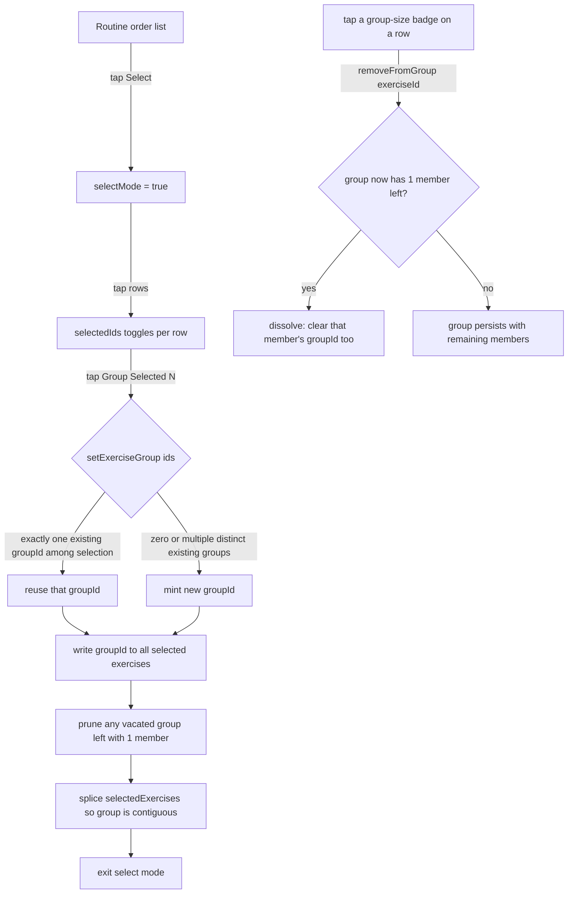
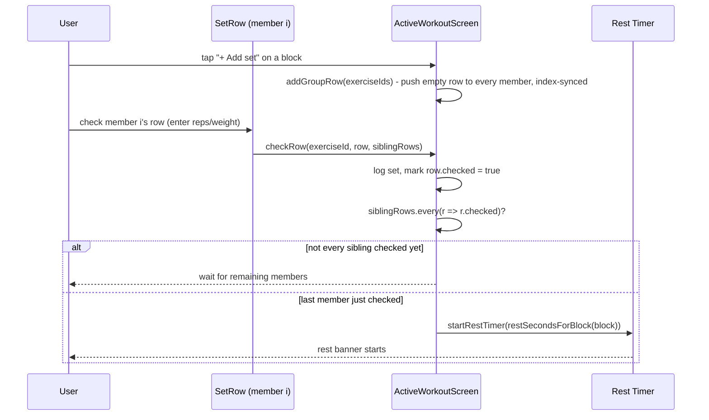
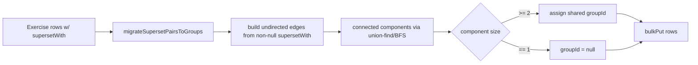
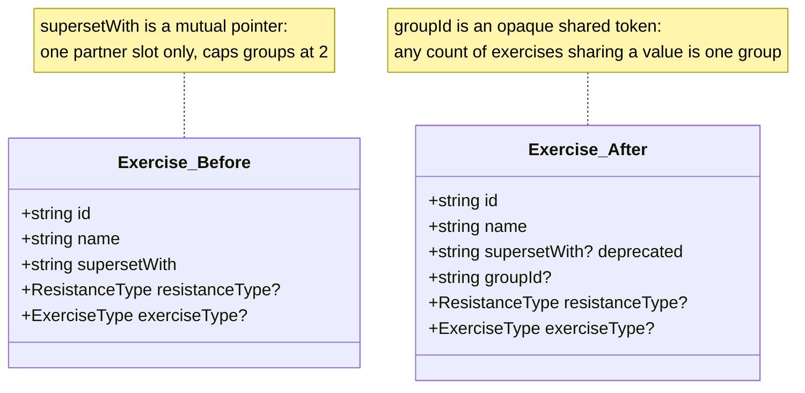
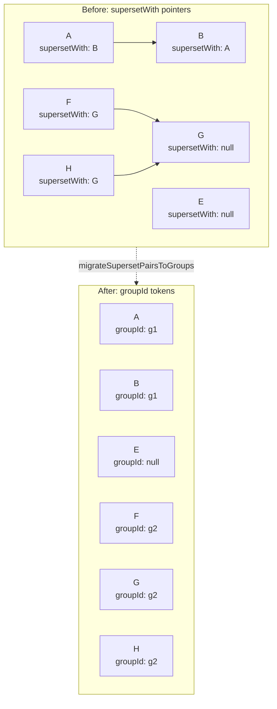

# EDD: N-Exercise Groups (Superset → Circuit)

| | |
|---|---|
| **Date** | 2026-09-26 |
| **Author** | Gregory McQuillan |

## Goal

Today a routine can link exactly 2 exercises into a "superset." That's not just a UI limit — `Exercise.supersetWith` (`src/shared/db/schema.ts:53`) is a single mutual-pointer scalar, one partner slot per exercise. A group of 3+ can't be expressed in that shape at all. The linking UX built on top of it — tap a link icon to "arm" a row, tap a second row's icon to complete the pair (`RoutineBuilderScreen.vue:132-160`) — is also the "wonky" flow we want replaced, independent of the data model problem.

This EDD covers supporting an arbitrary number (2+) of grouped exercises, with a cleaner selection UX, while preserving the lockstep behavior the app already has for pairs: one "Add set" advances every member together, and rest fires once the last member's current row is checked.

## Decisions locked in, not re-litigated here

1. **Selection UX**: select-mode button + tap-to-check-multiple, then a "Group Selected (N)" action button — the iOS-native pattern (Photos/Mail/Files "Select" + checkmarks + bottom action bar). Not a swipe/drag-select gesture — rows already carry a drag-to-reorder gesture (`useDragReorder`) and, elsewhere in the app, a swipe-to-reveal-actions gesture (`useSwipeReveal`); a third overlapping gesture is exactly the kind of conflict we're removing, not adding. `ShareRoutinesScreen.vue` already implements this exact checklist pattern (`selectedIds: Set<string>`, `toggle`, bottom action button) and is the pattern to copy.
2. **Lockstep preserved**: adding/removing a set still advances every exercise in the group together; rest timer still fires once every member's matching row is checked. This generalizes the existing pair logic to N-wide rather than redesigning the interaction.
3. **Terminology**: real-world fitness sources disagree at the boundary — a superset is consistently 2 exercises back-to-back; "giant set" is defined as 3+ by some sources but specifically 4+ by others (StrengthLog); "circuit training" is cited as 3+ across multiple sources, though it technically implies timed rounds/cardio mixing this app doesn't model. Given the disagreement exactly at 3 exercises, and that "circuit" is both the more consistently-cited term at 3+ and the word reached for originally, the display label is **"Superset"** at size 2 and **"Circuit"** at 3+, computed by one helper, never stored. The internal field name (`groupId`) is neutral and doesn't need to match the display word.
4. **Max group size: 5**, a UX-only cap (screen real estate — each member renders its own name/history line + `SetRow`), enforced only in the Routine Builder's Group button — never in the DB layer or import paths, since a foreign/imported payload with an oversized group must never throw.

## Architecture

Selection + grouping flow in `RoutineBuilderScreen.vue`:



Workout-logging lockstep, generalized to N members (`ActiveWorkoutScreen.vue`):



Import-path migration, run once at DB-open time and reused for any future-imported legacy payload:



## Data model



Two import paths write `Exercise[]` rows *after* the DB is already open, so Dexie's `.upgrade()` never sees them — an old exported backup/shared-routine file would silently lose pairings on import, forever, if not handled explicitly:
- `src/shared/db/backup.ts` `importAllData()` (line 44)
- `src/shared/db/sharing.ts` `importRoutines()` (line 121)

So `migrateSupersetPairsToGroups` is one pure function, reused in three places (the Dexie upgrade, and both import paths) — not three separate migrations. In-app runtime code (`RoutineBuilderScreen`, `ActiveWorkoutScreen`) never needs to read both fields: the upgrade transforms in-place data once, atomically, at DB-open time, before any screen runs.

Worked example — a clean pair, a standalone exercise, and a messy legacy chain (possible today since `clearSupersetLink` only enforced mutuality on the clear path, and guaranteed possible in foreign imported data):



`A`/`B` are a clean mutual pair → one component → shared `g1`. `E` has no link → stays `null`. `F`/`G`/`H` form a chain (`F→G`, `H→G`, but `G` never points back) — a shape the old mutual-pointer model never intended and the old UI couldn't produce cleanly, but `clearSupersetLink`'s partial-clear path or a hand-edited import could. The connected-components walk still resolves all three into one component and assigns one shared `g2`, rather than silently dropping `H`'s link or crashing on the asymmetry.

## Changes

### 1. `src/shared/db/schema.ts`

```ts
export const MAX_GROUP_SIZE = 5;

export function groupLabel(count: number): string {
  return count >= 3 ? 'Circuit' : 'Superset';
}

/**
 * Treats every non-null supersetWith as an undirected edge and computes
 * connected components, so dangling (A→B, B→null) or chained (A→B→C)
 * legacy data collapses into one group instead of being dropped.
 * Components of size 1 get groupId: null. Detects "already migrated" by
 * field presence, not by any payload version number.
 */
export function migrateSupersetPairsToGroups(exercises: Exercise[]): Exercise[] {
  const byId = new Map(exercises.map((e) => [e.id, e]));
  const visited = new Set<string>();
  const result: Exercise[] = [];

  for (const exercise of exercises) {
    if (visited.has(exercise.id)) continue;
    if (exercise.groupId !== undefined) {
      result.push(exercise);
      visited.add(exercise.id);
      continue;
    }
    // BFS the undirected supersetWith graph starting from this exercise.
    const component: Exercise[] = [];
    const queue = [exercise.id];
    while (queue.length) {
      const id = queue.shift()!;
      if (visited.has(id)) continue;
      visited.add(id);
      const node = byId.get(id);
      if (!node) continue;
      component.push(node);
      if (node.supersetWith && !visited.has(node.supersetWith)) queue.push(node.supersetWith);
      for (const other of exercises) {
        if (other.supersetWith === id && !visited.has(other.id)) queue.push(other.id);
      }
    }
    const groupId = component.length >= 2 ? crypto.randomUUID() : null;
    for (const node of component) result.push({ ...node, groupId });
  }
  return result;
}
```

`Exercise` interface changes:

```ts
export interface Exercise {
  id: string;
  name: string;
  /** @deprecated superseded by groupId — kept only so migrateSupersetPairsToGroups
   *  can read pre-v4 rows and so imported legacy backups still validate.
   *  Never read for display. */
  supersetWith?: string | null;
  groupId?: string | null;
  resistanceType?: ResistanceType;
  exerciseType?: ExerciseType;
}
```

Dexie version bump:

```ts
this.version(4).stores({ exercises: 'id, name, groupId' })
  .upgrade(async (tx) => {
    const all = await tx.table('exercises').toArray();
    const migrated = migrateSupersetPairsToGroups(all);
    await tx.table('exercises').bulkPut(migrated);
  });
```

`.upgrade()` never runs on a fresh install (Dexie jumps straight to the latest schema), so the `version(4)` `stores()` definition must be self-consistent without it — it is, since both fields are optional. Note: Dexie index queries skip `null`, so "is this exercise ungrouped" must check `groupId == null` directly, never `.where('groupId').equals(null)`.

### 2. `src/shared/db/backup.ts`, `src/shared/db/sharing.ts`

```ts
// backup.ts, importAllData — before the existing bulkPut:
const exercises = migrateSupersetPairsToGroups(data.exercises!);
await db.exercises.bulkPut(exercises);
```

```ts
// sharing.ts, importRoutines — normalize incoming payload.exercises
// before the existing conflict-resolution loop builds exercisesToPut.
const normalized = migrateSupersetPairsToGroups(payload.exercises);
```

No-op for already-migrated payloads. Unlike `supersetWith`, `groupId` is not a foreign key to another exercise's id — it's an opaque shared token, so `importRoutines`'s existing id-remap-on-copy logic needs no change to keep grouping intact when one exercise in a group is copied to a new id and another is overwritten.

### 3. `src/shared/db/exercises.ts`

```ts
/**
 * Groups the given exercises together. If exactly one of them already
 * belongs to a group, that group is reused (so "add C to my existing
 * A+B superset" is the natural gesture); otherwise a fresh group id is
 * minted and all selected exercises are moved into it. No-ops (returns
 * null) below 2 ids.
 */
export async function setExerciseGroup(exerciseIds: string[]): Promise<string | null> {
  if (exerciseIds.length < 2) return null;
  return db.transaction('rw', db.exercises, async () => {
    const existing = await Promise.all(exerciseIds.map((id) => db.exercises.get(id)));
    const priorGroupIds = new Set(existing.filter((e) => e?.groupId).map((e) => e!.groupId as string));
    const groupId = priorGroupIds.size === 1 ? [...priorGroupIds][0] : crypto.randomUUID();
    await Promise.all(exerciseIds.map((id) => db.exercises.update(id, { groupId })));
    await pruneOrphanGroups([...priorGroupIds].filter((g) => g !== groupId));
    return groupId;
  });
}

/**
 * Removes one exercise from its group. If that leaves the group with
 * only one member, that remaining member is ungrouped too — a groupId
 * is never held by fewer than 2 exercises.
 */
export async function removeFromGroup(exerciseId: string): Promise<void> {
  await db.transaction('rw', db.exercises, async () => {
    const exercise = await db.exercises.get(exerciseId);
    if (!exercise?.groupId) return;
    const groupId = exercise.groupId;
    await db.exercises.update(exerciseId, { groupId: null });
    await pruneOrphanGroups([groupId]);
  });
}

async function pruneOrphanGroups(groupIds: string[]): Promise<void> {
  for (const groupId of groupIds) {
    const members = await db.exercises.where('groupId').equals(groupId).toArray();
    if (members.length === 1) {
      await db.exercises.update(members[0].id, { groupId: null });
    }
  }
}
```

`setSupersetLink`/`clearSupersetLink` and `createExercise`'s `supersetWith` param stay untouched and unused until cleanup (step 9).

### 4. `src/features/workout/ActiveWorkoutScreen.vue` — script

- `loadWorkout()`'s block-building groups routine exercises by `groupId` instead of a single-partner lookup (same "ad-hoc exercises never join a group" restriction as today, generalized from "partner" to "every member").
- `pairedRows` → `groupRows`:
  ```ts
  function groupRows(block: WorkoutBlock): { index: number; rows: SetRowState[] }[] {
    const first = setRowsByExercise[block.exercises[0].id];
    if (!first) return [];
    return first
      .map((_, index) => ({
        index,
        rows: block.exercises.map((e) => getRow(e.id, index)),
      }))
      .filter((entry): entry is { index: number; rows: SetRowState[] } => entry.rows.every((r) => r !== undefined));
  }
  ```
- `addSupersetRow`/`removeSupersetRow` → `addGroupRow`/`removeGroupRow`, taking `exerciseIds: string[]`:
  ```ts
  function addGroupRow(exerciseIds: string[]) {
    exerciseIds.forEach((id) => setRowsByExercise[id].push(makeEmptyRow()));
  }
  function removeGroupRow(exerciseIds: string[], index: number) {
    if (!exerciseIds.every((id) => isLastRow(id, index))) return;
    exerciseIds.forEach((id) => setRowsByExercise[id].splice(index, 1));
  }
  ```
- `checkRow`'s `partnerRow` param becomes `siblingRows: SetRowState[] = []`; the rest-timer gate becomes `siblingRows.every((r) => r.checked)` — an empty array is vacuously `true`, so every existing standalone call site needs zero changes.
- `restSecondsForBlock` needs no change — already `Math.max(...block.exercises.map(...))`, N-ready.

### 5. `src/features/workout/ActiveWorkoutScreen.vue` — template

- Header: `{{ block.exercises.map(e => e.name).join(' + ') }}` and `{{ groupLabel(block.exercises.length) }}` replacing the hardcoded `[0]`/`[1]` names and the fixed "Superset" label.
- Per-set card: `v-for="(exercise, i) in block.exercises"` indexed into `groupRows(block)`'s `rows[i]`, replacing the two fixed `<SetRow>` blocks.
- `@check="checkRow(exercise.id, group.rows[i], group.rows.filter((_, j) => j !== i))"`, `@remove="removeGroupRow(block.exercises.map(e => e.id), group.index)"`, `"+ Add set"` calls `addGroupRow(block.exercises.map(e => e.id))`.

Ship steps 4 and 5 together — the template still references `[0]`/`[1]` until step 5 lands, so step 4 alone would compile but render wrong.

### 6. `src/features/routines/RoutineBuilderScreen.vue`

- Remove `linkModeExerciseId`/`toggleLink`.
- Add, mirroring `ShareRoutinesScreen.vue`:
  ```ts
  const selectMode = ref(false);
  const selectedIds = ref<Set<string>>(new Set());
  function toggleSelected(id: string) {
    const next = new Set(selectedIds.value);
    if (next.has(id)) next.delete(id); else next.add(id);
    selectedIds.value = next;
  }
  ```
- "Select" button toggles `selectMode`; bottom "Group Selected (N)" action calls `setExerciseGroup([...selectedIds.value])`, then patches `groupId` onto the matching objects in `selectedExercises` (same pattern the current code uses to patch `supersetWith` locally after a write).
- While `selectMode` is on, disable the row's drag handle (`onRowPointerDown`) and make the row body itself the tap target for `toggleSelected` — rows currently have no tap handler when not in select mode, so this is additive, not a conflict.
- Per-row badge shows `groupLabel(count)` for the exercise's current group size and is independently tappable to `removeFromGroup` — no ambiguous "is this Group or Ungroup" toggle like the old flow.
- `MAX_GROUP_SIZE` enforced here only: disable "Group Selected" when the resulting group would exceed it.
- After a successful group action, splice `selectedExercises` so all members sit contiguously starting at the earliest member's index — otherwise the builder's displayed order can diverge from how `ActiveWorkoutScreen` renders the block (which emits at the first member's routine position).

### 7. Cleanup (optional, lowest priority)

Delete `setSupersetLink`, `clearSupersetLink`, and `createExercise`'s `supersetWith` param once nothing references them. Leave the deprecated `supersetWith` schema field in place rather than adding a `version(5)` migration to strip it — matches this codebase's existing pattern of harmless optional legacy fields (`resistanceType?`, `bandColors?`, `mood?`).

## Out of scope

- A separate "position in circuit" field. Ordering within a group is exactly the order set in Routine Builder's drag-reorder list — unchanged, existing behavior — and step 8's contiguous-splice keeps a group's members adjacent in that list so builder order and workout-render order stay identical. No new ordering concept is introduced on top of it.
- Independent per-exercise set counts within a group (lockstep is preserved by explicit decision, see above).
- Any change to rest-duration calculation beyond what already generalizes for free (`restSecondsForBlock`).
- A `version(5)` migration to physically drop `supersetWith` — deferred indefinitely per the cleanup note above.

## Sequencing

Atomic, independently-committable steps; `vue-tsc` type-check must pass clean at every stop — confirm the exact script name in `package.json` before starting:

1. This doc — no code changes.
2. `schema.ts`: `MAX_GROUP_SIZE`, `groupLabel`, `migrateSupersetPairsToGroups` — dead code, nothing calls it yet.
3. `schema.ts`: add `groupId`, deprecate `supersetWith`, bump to `version(4)` with `.upgrade()`. Manual check: open the app on a DB with an existing pair, confirm it still displays exactly as before (upgrade ran without disturbing the still-live `supersetWith` read path).
4. `backup.ts` + `sharing.ts`: wire `migrateSupersetPairsToGroups` into both import paths. Manual test: import a pre-v4 backup JSON containing a real pair, confirm it renders as a group post-import.
5. `exercises.ts`: add `setExerciseGroup`/`removeFromGroup`/`pruneOrphanGroups` — unused by any screen yet.
6. `ActiveWorkoutScreen.vue` script: `groupRows`, `addGroupRow`/`removeGroupRow`, `checkRow` siblings generalization.
7. `ActiveWorkoutScreen.vue` template: N-wide render loop, joined name header, `groupLabel`. Manual verification required (this repo's `tsconfig` has no `strictTemplates`, so template arg-shape mistakes can slip past `vue-tsc`): exercise a standalone exercise, an existing 2-exercise superset, and a fresh 3-exercise circuit — check add-set lockstep and single-rest-timer-fire on each.
8. `RoutineBuilderScreen.vue`: select-mode + Group/Ungroup UI, contiguous reordering.
9. Cleanup: delete `setSupersetLink`/`clearSupersetLink`/`createExercise`'s `supersetWith` param.

## Verification

- Type-check after each step.
- Manual, per the notes above: existing-pair display survives step 3's migration; pre-v4 backup import round-trips after step 4; standalone/2-exercise/3-exercise workout logging (lockstep add-set, single rest-timer fire) after step 7; new grouping/ungrouping flow and contiguous ordering after step 8.
- One commit per numbered step — stop and review after each, don't batch.
