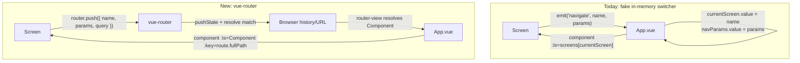
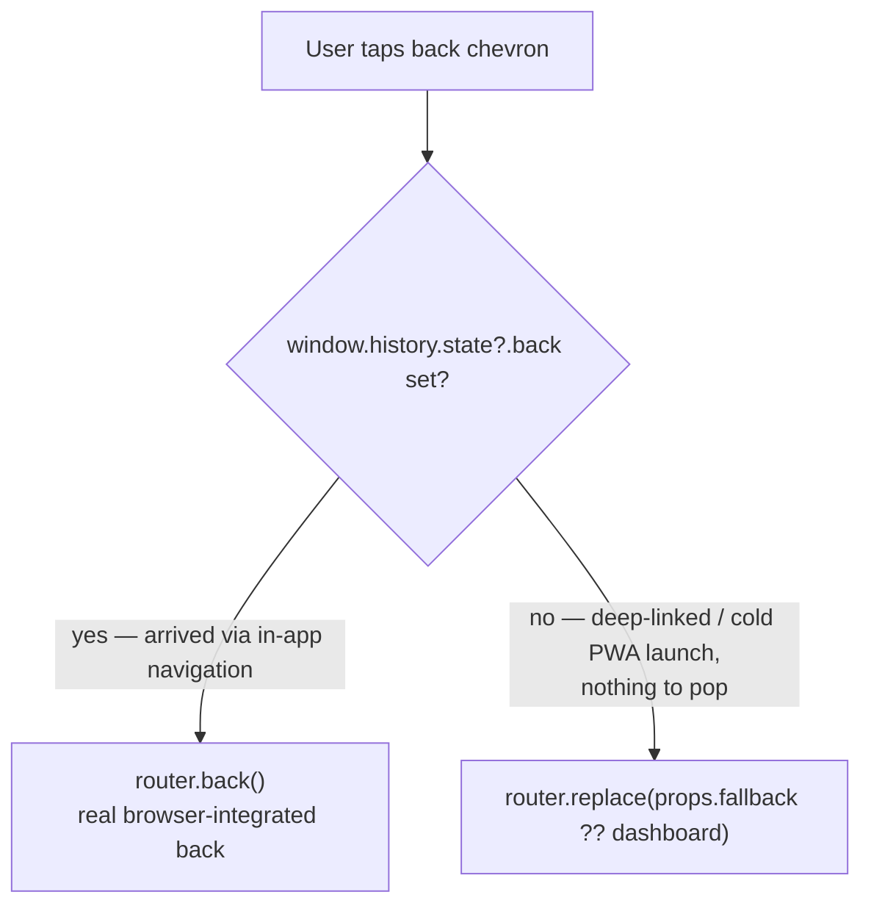
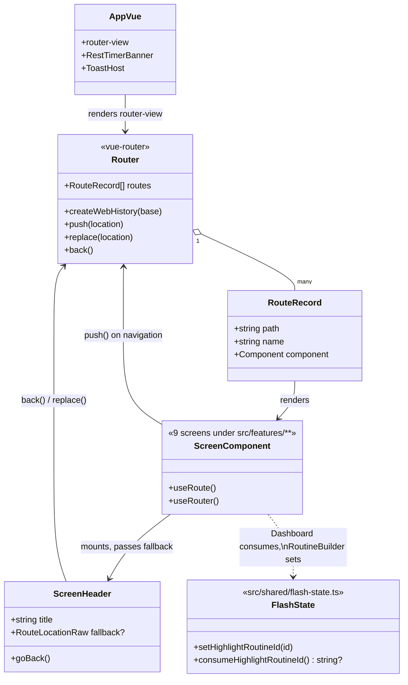

# EDD: Real Client-Side Routing (vue-router)

## Goal

irontrack has no router today. `src/App.vue` fakes screen switching with a
`ref<ScreenName>('dashboard')` + `shallowRef<NavParams>({})`, rendered via
`<component :is="screens[currentScreen]">`. Screens emit
`navigate(screen, params)` up to `App.vue`, which mutates those two refs.
There is no `history.pushState`, no `popstate` listener, no URL involvement
anywhere in `src/` (confirmed: zero hits for `URLSearchParams`,
`location.hash`, `history.push/replaceState`, `popstate` in `src/`).
Consequences, tracked as a known bug in `UP_NEXT.md` and called out as
explicitly out-of-scope in `docs/edd-workout-history-rework.md` decision 5:

- The browser's real Back/Forward buttons do nothing useful — they leave or
  reload the SPA instead of stepping through in-app navigation.
- No deep links — no way to bookmark or share a URL to a specific workout
  session, routine editor, etc.
- "Back" inside the app is a hardcoded per-screen destination (e.g.
  `WorkoutSessionDetailScreen` always goes back to `workout-history`,
  regardless of where the user actually came from), not a real stack.

Goal: adopt `vue-router` so the URL reflects the current screen/params/query,
browser Back/Forward work correctly, and deep links work — including
offline, since this is an offline-first PWA, and across all three deploy
targets (local dev, Docker/nginx, GitHub Pages).

## Router choice

`vue-router@4.6.4` (exact pin — this repo pins every dependency without a
caret, e.g. `"vue": "3.5.39"`), added to `dependencies` (not `devDependencies`,
it's a runtime library). Not `vue-router@5` — 5.x adds `pinia: '^3.0.4 ||
^4.0.2'` and `@pinia/colada` as forced peer dependencies for its new
data-loader integration; irontrack has no state-management library today and
doesn't need one for a static 9-route table, so pulling those in would be an
unjustified footprint. 4.6.4's only peer dependency is `vue: ^3.5.0`, matching
the installed `vue@3.5.39` exactly.

`createWebHistory(import.meta.env.BASE_URL)` — real paths, not hash routing.
`import.meta.env.BASE_URL` already reflects `vite.config.js`'s existing
`base: process.env.DEPLOY_BASE || '/'` scheme (`/` locally/Docker,
`/irontrack/` on GitHub Pages), the same value `main.ts` already uses to build
the service worker's registration URL — no new env var, no drift risk between
the two.

## Architecture



Back-button decision logic (moves from "hardcoded per-screen destination" into
`ScreenHeader.vue` itself):



## Router / component model



`ScreenName`/`NavParams` (today's ad-hoc, unchecked-shape types in
`src/shared/types.ts`) are deleted once every screen is converted — `RouteRecord`
names and typed `route.params`/`route.query` reads replace them.

## Route table

| Screen | Route | Params |
|---|---|---|
| dashboard | `/` | — |
| settings | `/settings` | — |
| routine-builder (create) | `/routines/new` — route name `routine-builder-new` | — |
| routine-builder (edit) | `/routines/:routineId/edit` — route name `routine-builder-edit` | path |
| share-routines | `/share-routines` | — |
| active-workout | `/workout/:routineId` | path |
| workout-history | `/history` | — |
| workout-session-detail | `/history/:sessionId?` | path when present; else legacy `?sessionDate=&routineId=` query |
| body-metrics | `/body-metrics` | — |
| progress-chart | `/progress` | optional `?exerciseId=` query |

Plus a catch-all: `{ path: '/:pathMatch(.*)*', redirect: { name: 'dashboard' } }`.

`routine-builder` create/edit are two named routes onto the same component —
idiomatic vue-router, avoids an awkward optional-param-with-fixed-suffix path.
`progress-chart`'s exercise id is a query param, not a path param — the
screen already treats it as a mutable initial selection
(`ref(props.navParams?.initialExerciseId || '')`), not a canonical resource
identity.

**`highlightRoutineId` stays out of the URL.** It's a one-shot "jiggle this
card" animation cue (`DashboardScreen`, triggered after `RoutineBuilderScreen`
saves), not identity/resource state — a query string would leave a stale
fragment that wrongly re-triggers the animation if the dashboard URL is
bookmarked or reopened later. New tiny module instead:

```ts
// src/shared/flash-state.ts
import { ref } from 'vue';

const pendingHighlightRoutineId = ref<string | null>(null);

export function setHighlightRoutineId(id: string): void {
  pendingHighlightRoutineId.value = id;
}

export function consumeHighlightRoutineId(): string | null {
  const id = pendingHighlightRoutineId.value;
  pendingHighlightRoutineId.value = null;
  return id;
}
```

Plain in-memory `ref` is sufficient (no `sessionStorage`) — this is always a
same-runtime SPA navigation, never a full page reload, exactly like today's
equally in-memory `shallowRef<NavParams>`.

## Changes

### 1. `src/router/index.ts` (new)

```ts
import { createRouter, createWebHistory } from 'vue-router';
import DashboardScreen from '../features/dashboard/DashboardScreen.vue';
// ...one import per screen, matching App.vue's existing import list

export const router = createRouter({
  history: createWebHistory(import.meta.env.BASE_URL),
  routes: [
    { path: '/', name: 'dashboard', component: DashboardScreen },
    { path: '/settings', name: 'settings', component: SettingsScreen },
    { path: '/routines/new', name: 'routine-builder-new', component: RoutineBuilderScreen },
    { path: '/routines/:routineId/edit', name: 'routine-builder-edit', component: RoutineBuilderScreen },
    { path: '/share-routines', name: 'share-routines', component: ShareRoutinesScreen },
    { path: '/workout/:routineId', name: 'active-workout', component: ActiveWorkoutScreen },
    { path: '/history', name: 'workout-history', component: WorkoutHistoryScreen },
    { path: '/history/:sessionId?', name: 'workout-session-detail', component: WorkoutSessionDetailScreen },
    { path: '/body-metrics', name: 'body-metrics', component: BodyMetricsScreen },
    { path: '/progress', name: 'progress-chart', component: ProgressChartScreen },
    { path: '/:pathMatch(.*)*', redirect: { name: 'dashboard' } },
  ],
});
```

### 2. `src/main.ts`

```ts
import { router } from './router';
// ...
await ensureMetricBlueprintsSeeded();
const app = createApp(App);
app.use(router);
await router.isReady(); // resolve initial route (incl. deep link) before mount
app.mount('#app');
```

### 3. `src/shared/flash-state.ts` (new)

As shown above.

### 4. `src/shared/components/ScreenHeader.vue`

```vue
<script setup lang="ts">
import { useRouter, type RouteLocationRaw } from 'vue-router';
import IconButton from './IconButton.vue';

const props = defineProps<{ title: string; fallback?: RouteLocationRaw }>();
const router = useRouter();

function goBack(): void {
  // history.state.back is set by vue-router's HTML5 history on every push;
  // null only on a fresh/deep-linked load with no in-app predecessor.
  if (window.history.state?.back) {
    router.back();
  } else {
    router.replace(props.fallback ?? { name: 'dashboard' });
  }
}
</script>

<template>
  <header class="...">
    <IconButton @click="goBack" aria-label="Back"> ... </IconButton>
    <h1 class="text-lg font-bold">{{ title }}</h1>
  </header>
</template>
```

The `back` emit is deleted — every parent screen's `@back="emit('navigate', X)"`
binding is removed too (see per-screen changes below).

### 5. `src/App.vue`

```vue
<script setup lang="ts">
import { RouterView } from 'vue-router';
import RestTimerBanner from './shared/components/RestTimerBanner.vue';
import ToastHost from './shared/components/ToastHost.vue';
</script>

<template>
  <router-view v-slot="{ Component, route }">
    <component :is="Component" :key="route.fullPath" />
  </router-view>
  <RestTimerBanner />
  <ToastHost />
</template>
```

The `screens` lookup, `ScreenName`/`NavParams` imports, `currentScreen`/
`navParams` refs, and `navigate()` are all deleted. `RestTimerBanner`/
`ToastHost` are unchanged — already siblings outside the switched component.

**`:key="route.fullPath"` is load-bearing, not decoration.** By default
`<router-view>` reuses the same component instance across navigations to the
same route record even when only a path param changes (e.g. editing routine A
then routine B would not remount `RoutineBuilderScreen`). Every screen reads
its params once at setup time today — safe only because the old
`<component :is>` fully unmounted/remounted on every navigation. Keying on
`route.fullPath` preserves that guarantee, so no screen needs to be rewritten
to reactively watch `route.params`.

### 6. Per-screen conversions (all 9 screens under `src/features/**`)

Each screen today has exactly one `defineEmits<{ navigate: [...] }>()` and
nothing else emitted — deleted outright everywhere. Pattern (shown for
`ActiveWorkoutScreen.vue`, representative of all 9):

```ts
// before
const props = defineProps<{ navParams?: NavParams }>();
const emit = defineEmits<{ navigate: [screen: ScreenName, params?: NavParams] }>();
const routineId = props.navParams?.routineId || null;
// ...
emit('navigate', 'dashboard');
emit('navigate', 'progress-chart', { initialExerciseId: exerciseId });

// after
import { useRoute, useRouter } from 'vue-router';
const route = useRoute();
const router = useRouter();
const routineId = (route.params.routineId as string) || null;
// ...
router.push({ name: 'dashboard' });
router.push({ name: 'progress-chart', query: { exerciseId } });
```

Full per-screen mapping:

| Screen | Param reads | Navigation calls |
|---|---|---|
| `BodyMetricsScreen.vue` | none used | drop unused `navParams` prop, drop `@back` |
| `ProgressChartScreen.vue` | `route.query.exerciseId as string \|\| ''` | — |
| `ShareRoutinesScreen.vue` | none used | `<ScreenHeader :fallback="{ name: 'settings' }" />` |
| `SettingsScreen.vue` | none used | `router.push({ name: 'share-routines' })` |
| `WorkoutSessionDetailScreen.vue` | `route.params.sessionId`; legacy `route.query.sessionDate`/`routineId` | `<ScreenHeader :fallback="{ name: 'workout-history' }" />` |
| `WorkoutHistoryScreen.vue` | none used | `openDetail()` → `router.push({ name: 'workout-session-detail', params: { sessionId } })` or `{ query: { sessionDate, routineId } }` legacy |
| `ActiveWorkoutScreen.vue` | `route.params.routineId` | finish/cancel → dashboard; exercise link → progress-chart with `exerciseId` query |
| `RoutineBuilderScreen.vue` | `route.params.routineId` (edit) / none (create, `routine-builder-new`) | save calls `setHighlightRoutineId(id)` then `router.push({ name: 'dashboard' })` |
| `DashboardScreen.vue` | `consumeHighlightRoutineId()` replaces `navParams.highlightRoutineId` | every `emit('navigate', ...)` call site (most of any screen) converts to `router.push({ name, params/query })` |

### 7. `src/shared/types.ts`

`ScreenName` and `NavParams` deleted (final cleanup step, after every screen
is converted).

## Deploy fallback fixes

Real paths mean any deep link (`/history/<id>`, a refresh, a PWA cold
launch) must resolve to `index.html` so the router can boot and match
client-side. Three targets need this, plus the service worker for offline —
required, not optional, for an offline-first PWA:

1. **Docker/nginx** — no `nginx.conf` exists today; the stock `nginx:alpine`
   image's default config does `try_files $uri $uri/ =404`, which 404s any
   deep-linked path. New `nginx.conf`:
   ```nginx
   server {
       listen 80;
       server_name _;
       root /usr/share/nginx/html;
       index index.html;
       location / {
           try_files $uri $uri/ /index.html;
       }
   }
   ```
   `Dockerfile` adds `COPY nginx.conf /etc/nginx/conf.d/default.conf` after
   the `dist/` copy.

2. **GitHub Pages** — static hosting, no server rewrites possible. Since
   `base: '/irontrack/'` bakes absolute asset URLs into `index.html` at build
   time, a plain copy works as the SPA fallback:
   ```yaml
   - name: Add SPA fallback 404.html
     run: cp dist/index.html dist/404.html
   ```
   added to `.github/workflows/deploy-pages.yml` between "Build" and
   "Upload dist/ as Pages artifact". GH Pages serves this body as an HTTP 404
   (harmless — browsers render the body regardless of status on a top-level
   navigation) while leaving the address bar at the real deep path, so
   vue-router matches correctly once it boots.

3. **Service worker (`src/sw.js`)** — deep-link paths are never themselves
   precached (only hashed asset URLs from `self.__WB_MANIFEST` are). Offline
   + direct navigation to one currently hard-fails once the network fetch
   rejects. Extend the existing catch:
   ```js
   // before
   .catch(() => caches.match(event.request))

   // after
   .catch(() =>
     caches.match(event.request).then((cached) => {
       if (cached) return cached;
       if (event.request.mode === 'navigate') {
         return caches.match(`${self.registration.scope}index.html`);
       }
       return undefined;
     })
   )
   ```
   `self.registration.scope` is already base-aware (`main.ts` registers via
   `` `${import.meta.env.BASE_URL}sw.js` ``), so this automatically matches
   the manifest's own URL scheme in every deploy target. No change to the
   existing update-flow logic (`skipWaiting`/`SKIP_WAITING` message/
   `CACHE_NAME` hashing) — only the fetch handler's catch path. Must confirm
   `index.html` is actually present in the precache manifest at
   implementation time (add via `includeAssets`/`globPatterns` in the
   `VitePWA()` config in `vite.config.js` if it's missing).

4. **Vite dev server** — already has built-in SPA fallback, no action needed.

## Out of scope

- `vue-router@5` / Pinia adoption — no current need for a data-loader layer.
- Route-level code splitting / lazy `() => import(...)` component loading —
  9 screens is small; can be added later without touching the route table
  shape.
- Route transition animations.
- Rewriting any screen's internals beyond the prop/emit → route param/push
  swap described above.

## Sequencing

Atomic, independently-committable steps; `npm run type-check` must pass clean
at every stop, per this project's CLAUDE.md:

1. This doc — no code changes.
2. Add `vue-router@4.6.4` to `package.json`. Create `src/router/index.ts`
   with the full route table + catch-all; register in `main.ts`
   (`app.use(router)`, `await router.isReady()` before `.mount()`).
   `App.vue`'s template is untouched — router exists but nothing renders
   `<router-view>` yet, so behavior is unchanged.
3. Add `src/shared/flash-state.ts` — new, unused until steps 10/11.
4. Rewrite `ScreenHeader.vue`'s back button to the `useRouter()` +
   `history.state.back` + `fallback` prop design. No screen passes
   `fallback` yet and old `@back` bindings are still present but now inert
   (Vue allows unconsumed listeners) — net-zero visible behavior change.
5. `BodyMetricsScreen.vue` conversion.
6. `ProgressChartScreen.vue` conversion.
7. `ShareRoutinesScreen.vue` conversion.
8. `SettingsScreen.vue` conversion.
9. `WorkoutSessionDetailScreen.vue` conversion.
10. `WorkoutHistoryScreen.vue` conversion.
11. `ActiveWorkoutScreen.vue` conversion.
12. `RoutineBuilderScreen.vue` conversion.
13. `DashboardScreen.vue` conversion (most call sites, do last of the nine).

    Note: steps 5–13 are individually buildable/typecheck-clean, but full
    click-through correctness has a transient gap during this run (`App.vue`
    still drives the old switcher, so a converted screen's `router.push`
    updates the URL/router state without the switcher reacting) — bounded to
    this contiguous stretch, closed at step 14.

14. **`App.vue` cutover** — swap in `<router-view>`. Single highest-risk
    step; full click-through correctness is restored here. Manually
    smoke-test every navigation path (all 9 screens, back button on each,
    deep-link a session detail URL directly).
15. Docker/nginx SPA fallback (`nginx.conf` + `Dockerfile`).
16. GitHub Pages `404.html` step in `deploy-pages.yml`.
17. Service worker navigation fallback (`sw.js` fetch-handler diff).
18. Cleanup: delete `ScreenName`/`NavParams` from `src/shared/types.ts`; grep
    repo-wide for `navParams`/`ScreenName`/`emit('navigate'` to confirm
    nothing remains.

Steps 15–17 have no dependency on 1–14 and could be reordered earlier or
done in parallel — placed last since they're only meaningful once real
routes exist to protect.

## Verification

- `npm run type-check` after each step.
- `npm run dev`, manually click through every screen + back button + browser
  Back/Forward buttons after step 14.
- `npm run build && npm run preview`, load a deep link (e.g.
  `/history/<real-session-id>`) directly, then test offline reload after
  step 17 (DevTools → Offline → reload).
- `docker build .` + curl a deep path after step 15.
- Inspect `dist/404.html` exists and matches `dist/index.html` after step 16.
