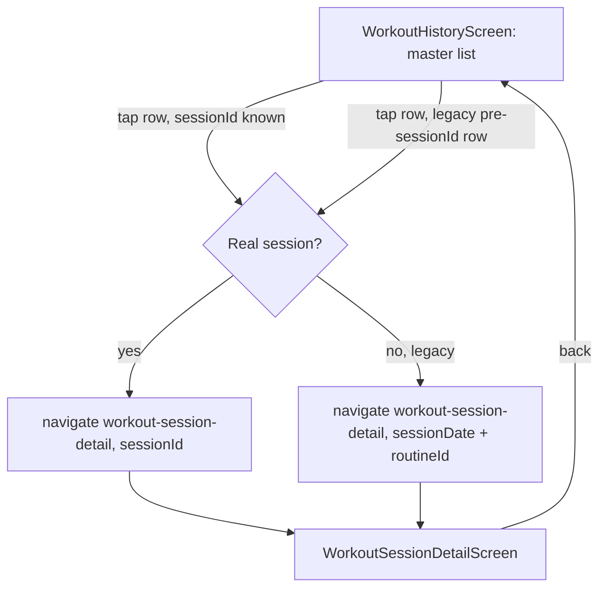
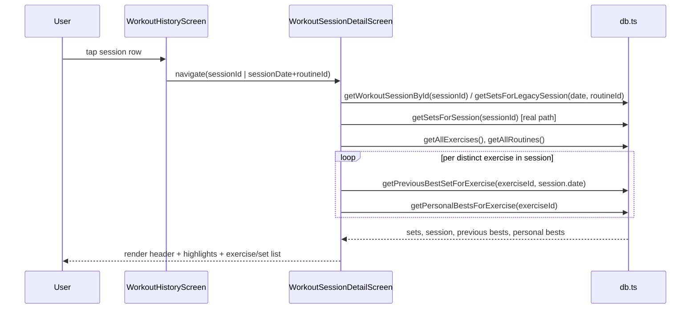
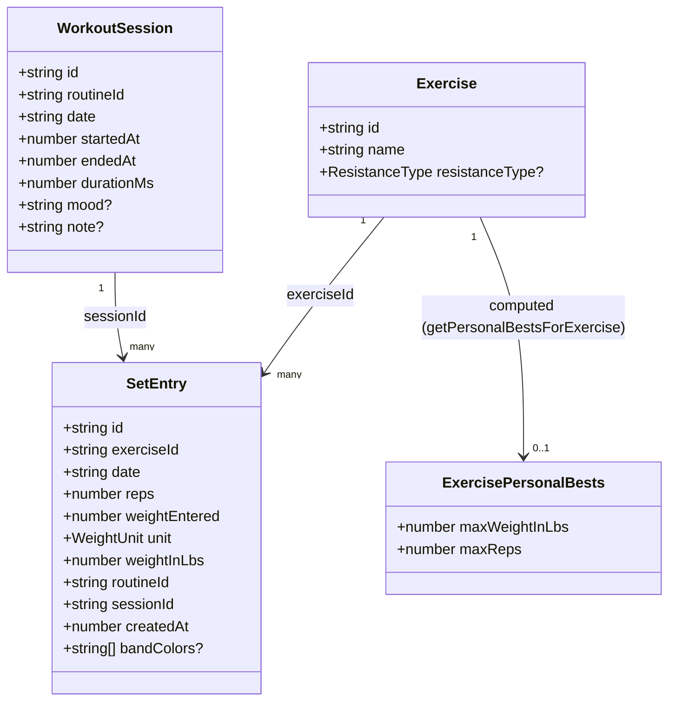

# EDD: Workout History Master/Detail Rework

## Goal

`WorkoutHistoryScreen.vue` (`src/features/history/WorkoutHistoryScreen.vue`, 350 lines) today is a single flat list — one card per session, small text (`text-xs`/`text-sm` pills), every set editable inline in place. `UP_NEXT.md` lists this screen's readability as planned backlog: bigger text, a master/detail split (list side shows names + summary only, detail side shows full set data), plus — confirmed in this round of planning — session highlights (heaviest lift / most reps) and a strength-progression comparison against the previous time each exercise was performed.

The app has no router — navigation is a hand-rolled `screens: Record<ScreenName, Component>` map + `navigate(screen, params)` in `App.vue` — and no existing responsive split-pane layout anywhere in the codebase. Rather than build a first-of-its-kind responsive shell now, master/detail ships as **navigation to a new screen**, the same pattern `DashboardScreen` already uses to open `RoutineBuilderScreen` via `navigate('routine-builder', { routineId })`. Deliberate stepping stone: the detail screen is its own component, so a later "true split pane for wide screens" task reuses it inline instead of rebuilding it.

All-time PR tracking doesn't exist in `db.ts` today — only `getLastWorkoutBestSetForExercise` (`db.ts:470`), a same-session/most-recent-other-session heaviest-set lookup used for `ActiveWorkoutScreen`'s ghost text. New query helpers are added rather than repurposing that function, since its current behavior is depended on elsewhere and must not change.

Decisions locked in with the user, not re-litigated here:
1. Legacy sets (logged before `SetEntry.sessionId` existed) get a `sessionDate` nav-param fallback so they stay tappable/editable, not dropped from the rework.
2. Progression comparison is strictly-earlier-calendar-date, not same-day sessions — an AM/PM double session never counts as its own "previous."
3. PR badges show even on an exercise's very first logged set (trivially both heaviest-ever and most-reps-ever; not suppressed for single-data-point exercises).
4. PR/highlight badge UI is a small shared `StatBadge.vue` component (two call sites: session highlights row, per-set PR tag).
5. Real routing (vue-router, fixing the browser-back-exits-app bug also tracked in `UP_NEXT.md`) is explicitly **out of scope** — a separate, later, cross-cutting task touching `App.vue` and all 8 screens. The new detail screen uses today's `navigate()` pattern like every other screen, so it migrates for free once a router lands.

## Architecture



Data load sequence for the new detail screen's `onMounted`:



## Data model

No schema migration — every addition is either a new function over the existing `sets`/`workouts` tables, or a plain computed (non-persisted) type.



`ExercisePersonalBests` is never stored — it's computed on demand from `getSetsForExercise` and held only in the detail screen's local state.

## Changes

### 1. `src/shared/types.ts`
- `ScreenName` gains `'workout-session-detail'`.
- `NavParams` gains:
  ```ts
  /** WorkoutSessionDetailScreen: the WorkoutSession.id to load. */
  sessionId?: string;
  /** WorkoutSessionDetailScreen legacy fallback, paired with routineId
   *  (reused), for sets logged before SetEntry.sessionId existed. */
  sessionDate?: string;
  ```
  A second fallback field instead of encoding both cases into one opaque `session::x` / `legacy::date::routineId` string — keeps every `NavParams` field a literal id, matching how `initialExerciseId`/`highlightRoutineId` are already screen-specific rather than a single overloaded param.

### 2. `src/App.vue`
- Import and register `'workout-session-detail': WorkoutSessionDetailScreen` in the `screens` map.

### 3. `src/shared/db.ts`
Five additions, all read-only, none touching the write path or existing Dexie indexes:

```ts
export function getWorkoutSessionById(id: string): Promise<WorkoutSession | undefined> {
  return db.workouts.get(id);
}

/** Sets for a pre-sessionId session, matched by date+routineId — the same
 *  key WorkoutHistoryScreen's existing legacy grouping already uses, so
 *  legacy rows keep working with no schema migration. */
export async function getSetsForLegacySession(date: string, routineId: string | null): Promise<SetEntry[]> {
  const sets = await getAllSets();
  return sets
    .filter((s) => !s.sessionId && s.date === date && (s.routineId || null) === routineId)
    .sort((a, b) => (a.createdAt || 0) - (b.createdAt || 0));
}

/** Heaviest set from the most recent date this exercise was logged
 *  strictly before beforeDate — distinct from getLastWorkoutBestSetForExercise,
 *  which excludes one session id rather than respecting chronological
 *  position (wrong when viewing an arbitrary historical session). That
 *  existing function's behavior/callers are untouched by this addition. */
export async function getPreviousBestSetForExercise(exerciseId: string, beforeDate: string): Promise<SetEntry | null> {
  const sets = await db.sets.where('exerciseId').equals(exerciseId).toArray();
  const candidates = sets.filter((s) => s.date < beforeDate);
  if (candidates.length === 0) return null;
  const mostRecentDate = candidates.reduce((max, s) => (s.date.localeCompare(max) > 0 ? s.date : max), candidates[0].date);
  const onThatDate = candidates.filter((s) => s.date === mostRecentDate);
  return onThatDate.reduce((heaviest, s) => (s.weightInLbs > heaviest.weightInLbs ? s : heaviest));
}

export interface ExercisePersonalBests {
  maxWeightInLbs: number;
  maxReps: number;
}

/** Full-history max weight/reps for one exercise. Call once per distinct
 *  exercise present in the viewed session — O(sets for that exercise) via
 *  the existing getSetsForExercise, not a scan of every exercise in the app. */
export async function getPersonalBestsForExercise(exerciseId: string): Promise<ExercisePersonalBests | null> {
  const sets = await getSetsForExercise(exerciseId);
  if (sets.length === 0) return null;
  return {
    maxWeightInLbs: Math.max(...sets.map((s) => s.weightInLbs)),
    maxReps: Math.max(...sets.map((s) => s.reps)),
  };
}
```

### 4. `src/shared/dateFormat.ts` (new)
`formatDate`/`formatDuration` moved verbatim out of `WorkoutHistoryScreen.vue`, exported as named functions — no other screen currently defines an equivalent, and the new detail screen needs both too.

### 5. `src/features/history/WorkoutSessionDetailScreen.vue` (new)
- `ScreenHeader` + `@back="emit('navigate', 'workout-history')"`.
- Loads via `getWorkoutSessionById` + `getSetsForSession` (real path) or `getSetsForLegacySession` (legacy path) depending on which `navParams` field is present, plus `getAllExercises()`/`getAllRoutines()` for names.
- Renders: header (routine name, date, duration), a highlights block (session-level heaviest/most-reps computed client-side from already-loaded sets, no extra query), a per-exercise list with full set detail, previous-session delta line, and all-time PR `StatBadge`s.
- Owns the inline edit/delete UI moved from the list screen: `EditableSet` type, `editingId`, `startEdit`/`cancelEdit`/`toggleEditUnit`/`editIsValid`/`saveEdit`/`deleteEntry`, `formattedSet`, and the resistanceType-branched edit form — adapted to operate on this screen's own loaded `exercises` state. Empty-group pruning on delete follows the same pattern as the current list screen; if a session's exercises empty out entirely, shows `EmptyState` (back button already in the header).

### 6. `src/features/history/WorkoutHistoryScreen.vue`
- Loses the per-set edit/delete UI and its supporting state (moved to Step 5 above); loses `updateSet`/`deleteSet`/`IconButton`/`BandColorPicker` imports.
- Template collapses to a summary row per session: exercise names (comma-joined), routine name, date, duration/mood pills, set count — no per-set detail.
- `@click` on each row navigates via `day.sessionId ? { sessionId: day.sessionId } : { sessionDate: day.date, routineId: day.routineId ?? undefined }`.
- Text sizes bumped: card title `text-base` → `text-lg font-semibold` (matches `DashboardScreen`'s card-title precedent, `DashboardScreen.vue:216,225,289`); date/meta `text-xs` → `text-sm`/`text-base`; exercise-name summary `text-sm` → `text-base`.
- `DayGroup` gains `sortTs: number` (`session.startedAt` when known, else max `createdAt` among its sets); `days.value` explicitly sorted `(a, b) => b.sortTs - a.sortTs` after grouping. Fixes a latent ordering issue: today's `bySession` Map iteration order happens to usually correlate with recency (since `getAllSets()` sorts by `date desc, createdAt desc`) but was never an explicit, guaranteed sort.

### 7. `src/shared/components/StatBadge.vue` (new)
`props: { label: string; tone?: 'neutral' | 'pr' }` — small badge, two call sites: the session-level highlights row and per-set "Heaviest ever"/"Most reps ever" tags.

## Out of scope

- vue-router migration (separate later task; see decision 5 above).
- Responsive side-by-side split-pane layout for wide/desktop viewports — the detail screen is built as its own component specifically so this can wrap it later without a rewrite.
- Per-exercise rest timers, cancel-workout, and the other unrelated `UP_NEXT.md` items.

## Sequencing

Atomic, independently-committable steps; project's type-check must pass clean at every stop:

1. This doc — no code changes.
2. `src/shared/types.ts` + `src/App.vue` + new `WorkoutSessionDetailScreen.vue` (placeholder body) + a one-line nav wire-up in `WorkoutHistoryScreen.vue`. Tapping a card opens a placeholder detail screen with correct params; nothing else changes.
3. `src/shared/db.ts` (`getWorkoutSessionById`, `getSetsForLegacySession`) + `src/shared/dateFormat.ts` + real data load and read-only rendering in the detail screen. List screen still has full inline edit — untouched.
4. Move inline edit/delete/`EditableSet`/etc. from the list screen into the detail screen. Brief transient duplication (list screen still renders full per-set detail even though editing has moved) — both screens stay correct and buildable.
5. Trim the list screen down to the lightweight summary-row master list, bump text sizes, add `sortTs` recency sort.
6. `getPreviousBestSetForExercise` + previous-session delta line in the detail screen.
7. `getPersonalBestsForExercise`/`ExercisePersonalBests` + `StatBadge.vue` + all-time PR badges + session highlights row.

## Verification

- Type-check after each step.
- Manual: log sets across 2+ sessions for the same exercise with varying weight/reps. Open Workout History — confirm large-text summary rows, sorted most-recent-first. Tap a row — confirm header, editable set list, previous-session delta, correct all-time PR badges (including on a first-ever-logged exercise). Confirm a legacy (pre-`sessionId`) row still opens via the `sessionDate` fallback and remains editable. Confirm deleting all sets in a session prunes cleanly back to `EmptyState`.
